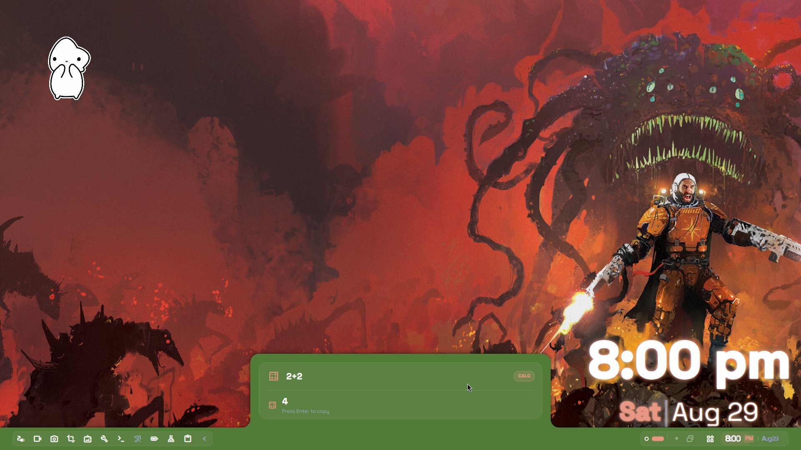

<div align="center">

  <h1>SYNOPTIK</h1>

  <p><strong>A fluid, morphing desktop shell built for Hyprland.</strong></p>

  <p>
    <a href="https://archlinux.org"></a>
    <a href="https://hyprland.org"></a>
    <a href="https://github.com/outfoxxed/quickshell"></a>
    <a href="LICENSE"></a>
  </p>

  <br />

  <a href="https://www.youtube.com/watch?v=Cv7NUWnxySg" target="_blank">
  
  </a>

  <p><em>▶ Click the banner above to watch the showcase video on YouTube</em></p>

</div>

---

> **syn·op·tik** _(/səˈnäptik/)_ — *Bringing disparate elements together into a single, unified view.*

**Synoptik** replaces fragmented docks, status bars, and app launchers with a unified, reactive interface. Instead of rendering static, disjointed surfaces, Synoptik acts as an adaptive surface that morphs its physical footprint to project control panels, telemetry, system controls, and launchers—contracting back into a minimal footprint when idle.

---

What inspired this quickshell environment?  After switching back and forth between the most popular shells, and finding that they were either beautiful but not functional, or functional but not simple, or simple but not beautiful...I decided to make one myself that perfectly suited my needs in both work and personal configurations.  This meant a fluid, customizable setup that can be tailored to any layout or visual aesthetic that I wanted, and one that can be changed easily and quickly.  For instance, my desktop might be better suited to having the bar on the left, but my laptop might work best with a collapsed pill at the top, maybe one that auto-hides when I'm not using it.

Rather than try to make one configuration that is versatile enough to work across multiple setups, it just made more sense to make the shell adaptable to any desired configuration a user might want.  There are four distinct layouts included in this shell for the bar, and you control what icons are always visible for you and the order they display in.  The colors can be manually defined, or you can let the wallpaper decide the color scheme.  These settings also carry over to your Hyprland config automatically to make everything cohesive and unified.

Another very distinct trait of this shell is that it is **NOT BORING**.  While some quickshell environments can look very professional and elegant, they tend to have some similarities that make them hard to differentiate.  No shade to any of them but let's inject some fun and style back into our desktop environments!  Without going too crazy with avant garde designs and over-the-top aesthetics, Synoptik proudly displays its own individual personality as a singular plane of control with style.  The bar doesn't summon panels or menus - it **_becomes_** the panel!  Each module is eye-catching and entirely unique to your configuration.  Blur, xray, transparency, even watermarks that (optionally) float inside the panels like amoebas...have as much or as little visual flair as you want.  Want more margin space?  Sharper corners?  A thick border around your bar?  Change your workspace indicators with multiple styles to choose from.  Add an audio visualizer to your desktop that can be tuned and rotated.  Add your favorite mascot with a GIF or image of your choice that bounces when a notification arrives, or bops to the beat of whatever music is playing.

Best of all, it's entirely built in a single Quickshell environment without a lot of clutter or complicated scripts.  There are no system-breaking dependencies or highly customized app requirements.  You probably have everything it uses already installed, but if not, the install script takes care of everything for you.  You don't need to touch your hyprland config at all to use this!

---

## ✨ Key Features

* **Morphing Layouts:** A single persistent surface that fluidly expands and shifts into dedicated modules (App Launcher, Control Center, Media Player) without layout jumps.
* **Compositor Integration:** Leverages native Hyprland layer-shell protocol features, including real-time dynamic blur, custom alpha blending, and xray passthrough.
* **Integrated Lock & Idle IPC:** Bundled `hypridle` and custom IPC hooks for smooth screen locking and screensaver transitions.
* **Zero Boilerplate Deployment:** Single-command setup script with automatic self-update tracking.

---

## 📸 Screenshots

<div align="center">

|  |  |
|:---:|:---:|
|  |  |
| Control Center | Calendar & Notes |
|  |  |
| Wallpaper Picker | Search |
|  |  |
| Power Menu | Workspace Overview |

</div>

---

## ⚡ Quick Install

> [!WARNING]
> **Synoptik is under active development.** Check your existing configuration files before overwriting system styles.

Run the automated installer to clone the repository, link components, and enable update tracking:

```bash
curl -fsSL https://raw.githubusercontent.com/natepayn3/Synoptik/main/install.sh | bash
```

Use --dry-run to see what it would add to your system:

```bash
curl -fsSL https://raw.githubusercontent.com/natepayn3/Synoptik/main/install.sh | bash -s -- --dry-run
```

and there is also an uninstall.sh that can be run directly
