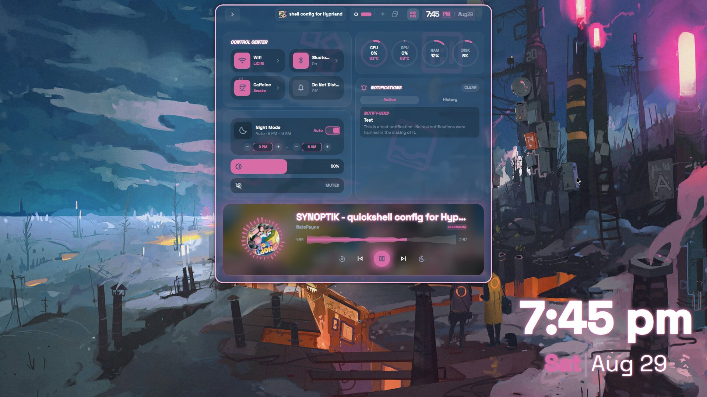
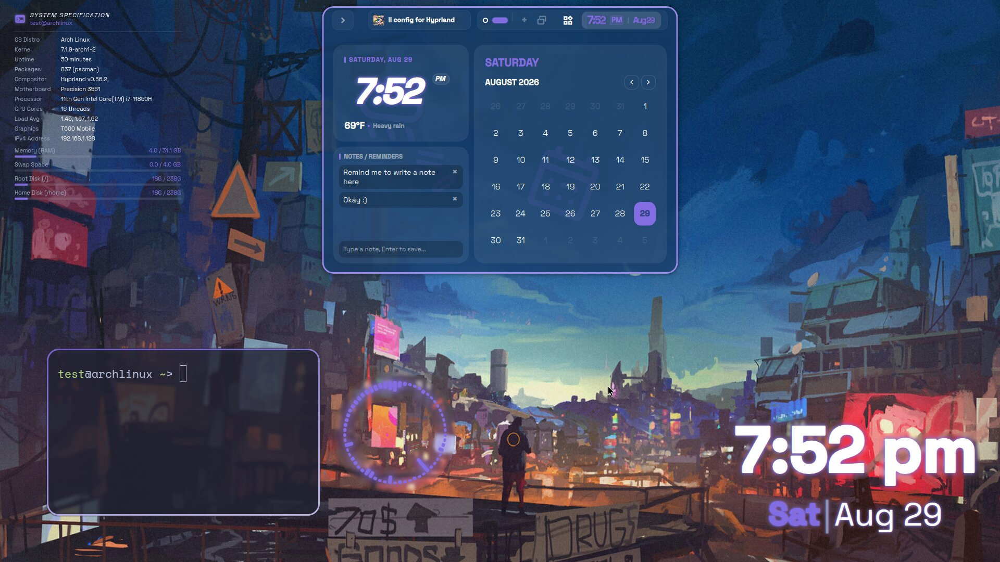
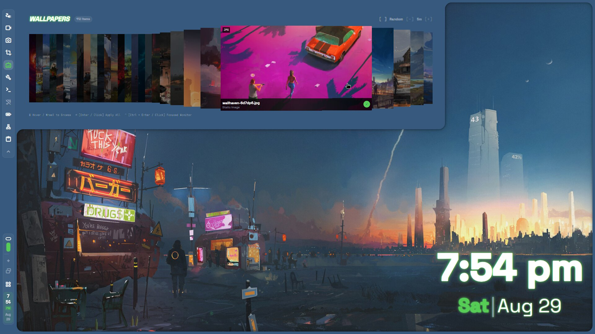
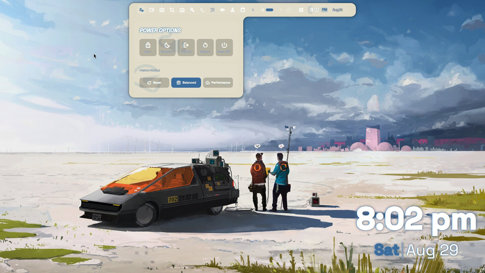
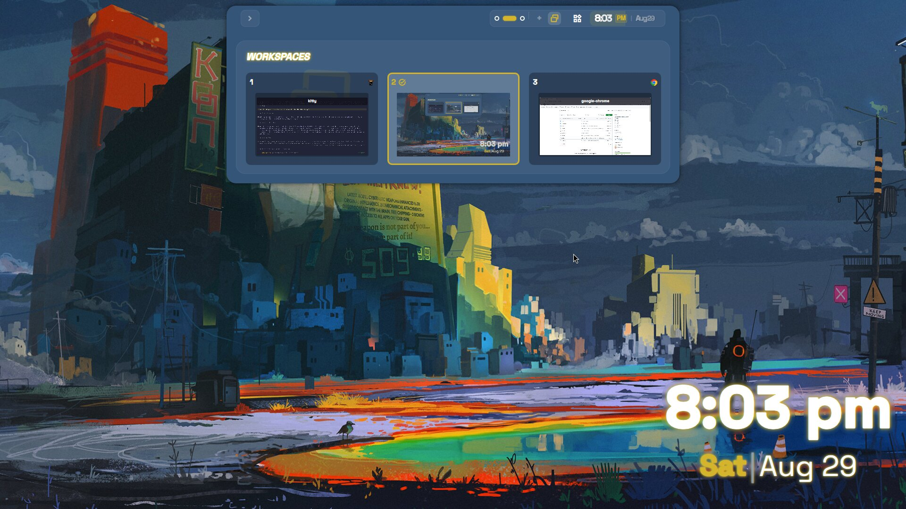

<div align="center">

  <h1>SYNOPTIK</h1>

  <p><strong>A fluid, morphing desktop shell built for Hyprland.</strong></p>

  <p>
    <a href="https://archlinux.org"></a>
    <a href="https://hyprland.org"></a>
    <a href="https://github.com/outfoxxed/quickshell"></a>
  </p>

  <br />

  <a href="https://www.youtube.com/watch?v=Cv7NUWnxySg" target="_blank">
  
  </a>

  <p><em>▶ Click the banner above to watch the showcase video on YouTube</em></p>

</div>

---

> **syn·op·tik** _(/səˈnäptik/)_ — *Bringing disparate elements together into a single, unified view.*

**Synoptik** replaces fragmented docks, status bars, and app launchers with a unified, reactive interface. Instead of rendering static, disjointed surfaces, Synoptik acts as an adaptive surface that morphs its physical footprint to project control panels, telemetry, system controls, and launchers—contracting back into a minimal footprint when idle.

---

## ✨ Key Features

* **Morphing Layouts:** A single persistent surface that fluidly expands and shifts into dedicated modules (App Launcher, Control Center, Media Player) without layout jumps.
* **Compositor Integration:** Leverages native Hyprland layer-shell protocol features, including real-time dynamic blur, custom alpha blending, and xray passthrough.
* **Integrated Lock & Idle IPC:** Bundled `hypridle` and custom IPC hooks for smooth screen locking and screensaver transitions.
* **Zero Boilerplate Deployment:** Single-command setup script with automatic self-update tracking.

---

## 📸 Screenshots

<div align="center">

|  |  |
|:---:|:---:|
|  |  |
| Control Center | Calendar & Notes |
|  |  |
| Wallpaper Picker | App Launcher |
|  |  |
| Power Menu | Workspace Overview |

</div>

---

## ⚡ Quick Install

> [!WARNING]
> **Synoptik is under active development.** Check your existing configuration files before overwriting system styles.

Run the automated installer to clone the repository, link components, and enable update tracking:

```bash
curl -fsSL https://raw.githubusercontent.com/natepayn3/Synoptik/main/install.sh | bash
```

Use --dry-run to see what it would add to your system, and there is also an uninstall.sh
